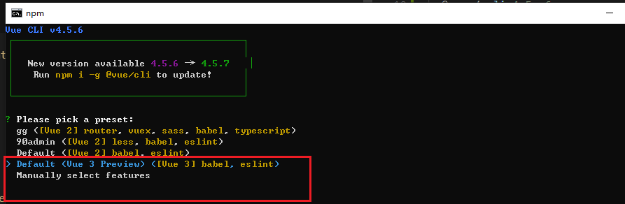
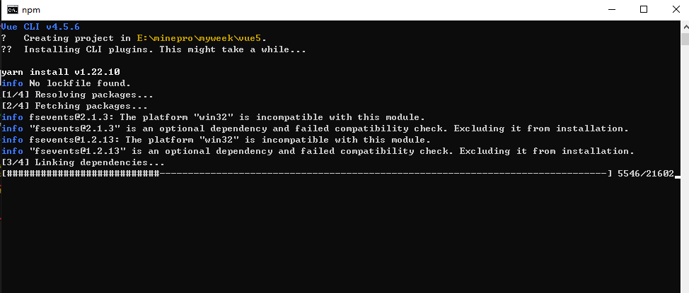
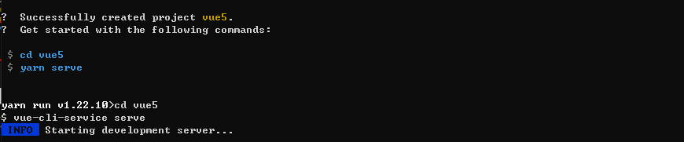
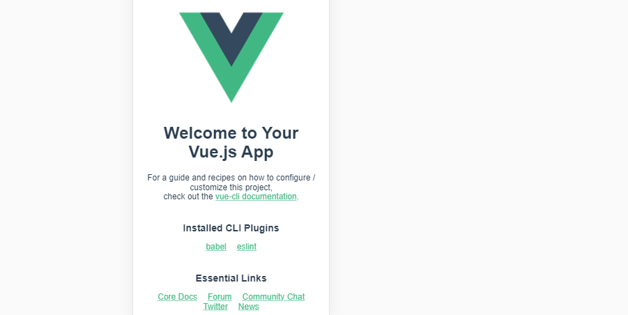
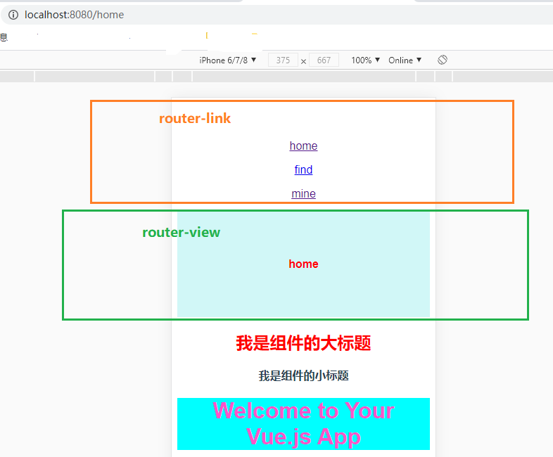

@[TOC](vue3.0项目搭建以及路由router配置)

## 一、安装

- 安装 vue-cli： `yarn add @vue/cli -g`
- 检查是否安装成功：

```js
  E: \minepro\ myweek > vue - V
  @vue / cli 4.5 .6
```

- 创建项目： `vue create vue5(项目名称)`
- 选择后回车：
- 等待安装：
- 启动项目：
- 浏览器打开：

## 二、路由

#### 1. 路由版本： `yarn add vue-router@4.0.0-beta.6 -S`

#### 2. 路由说明：

| 名称                                        | 说明                | 补充      |
| ------------------------------------------- | ------------------- | --------- |
| createWebHashHistory(process.env. BASE_URL) | hash 路由           | 有‘#’号   |
| createWebHistory                            | history 路由        | 没有‘#’号 |
| createMemoryHistory                         | 带缓存 history 路由 | 后续补充  |
| parseQuery                                  | 查询参数反序列化    | 后续补充  |
| stringifyQuery                              | 查询参数序列化      | 后续补充  |
| onBeforeRouteLeave                          | 路由离开钩子        | 后续补充  |

#### 3. 路由配置

- 导入路由系列：
  - `import { createWebHistory, createRouter } from 'vue-router'`
- 创建路由
  - `const history = createWebHistory()`
- 配置页面逻辑

```js
const router = createRouter({
  history, // 路由模式
  routes: [
    {
      // 页面逻辑
      path: '/test',
      name: 'test',
      component: () => import('@/page/Test')
    }
  ]
})
```

#### 5. 路由调用

- 引入： `import router from './route'`
- 注入： `app.use(router)`

#### 6. 路由使用

- 切换触发： `<router-link to="/mine">mine</router-link>`
- 显示： `<router-view></router-view>`

#### 7. 效果图


